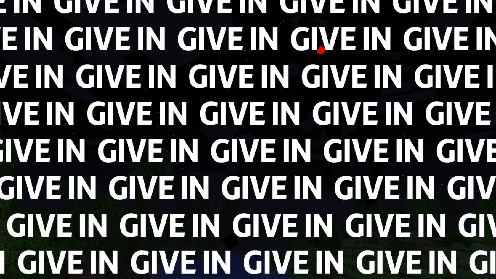
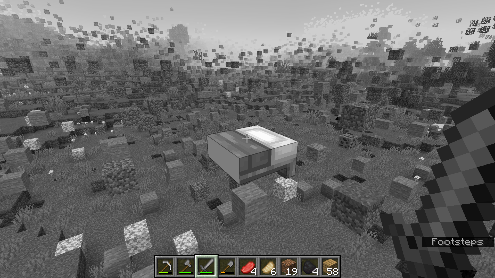
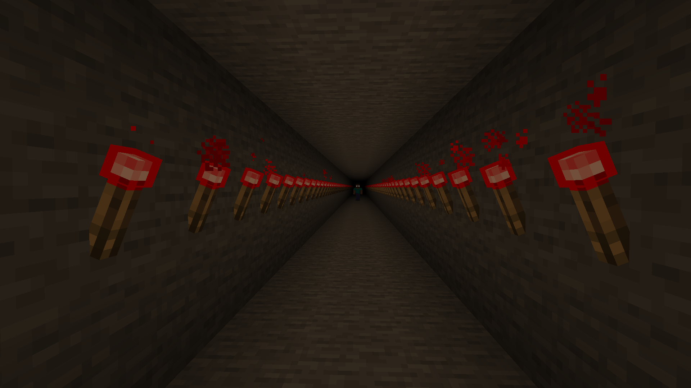
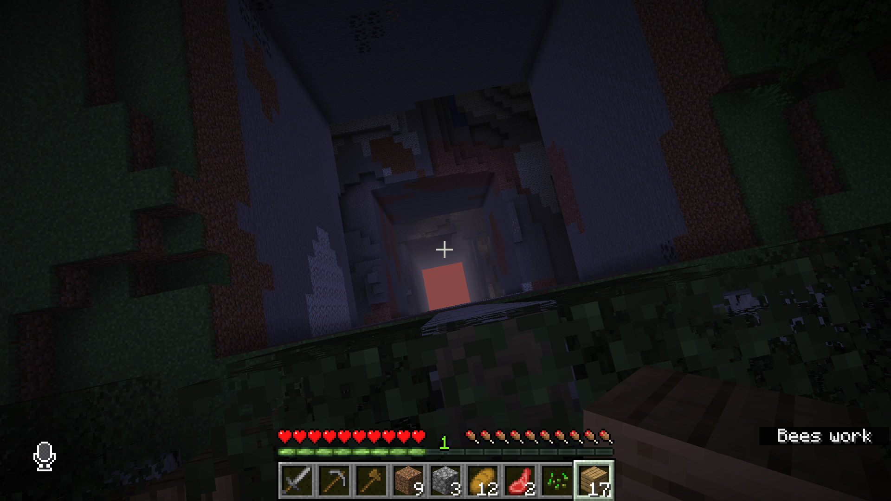

An immersive, slow-moving horror mod that sometimes breaks the fourth wall.

"The second-best horror mod ever!" - Me

## Multiplayer Warning
While your personal information is not shared outside the mod, it **may still be displayed within the world**.  
Make sure you trust the people you are playing with.  
You can enable **Streamer Mode** in the config to hide your name and location.

## Disclaimer
Dark Flame is not a virus, but it can:
- Access your IP address to determine your location.
- Read system variables, including your real name.
- Read files from your photos folder
- Interact with your computer outside of Minecraft (creating popups, files, opening applications).
- Ban you from your world or render it permanently unusable.

**Important:** Make backups of any worlds you care about before playing.  
This mod is intended for experienced players who fully understand and accept these risks.

  
  
  
  

---
*Proceed at your own risk.*

And yes, this was inspired by the broken script